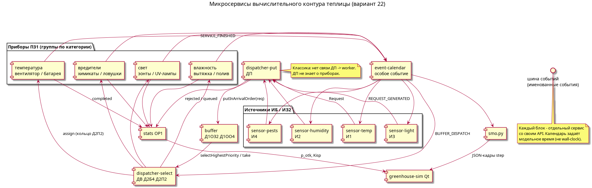
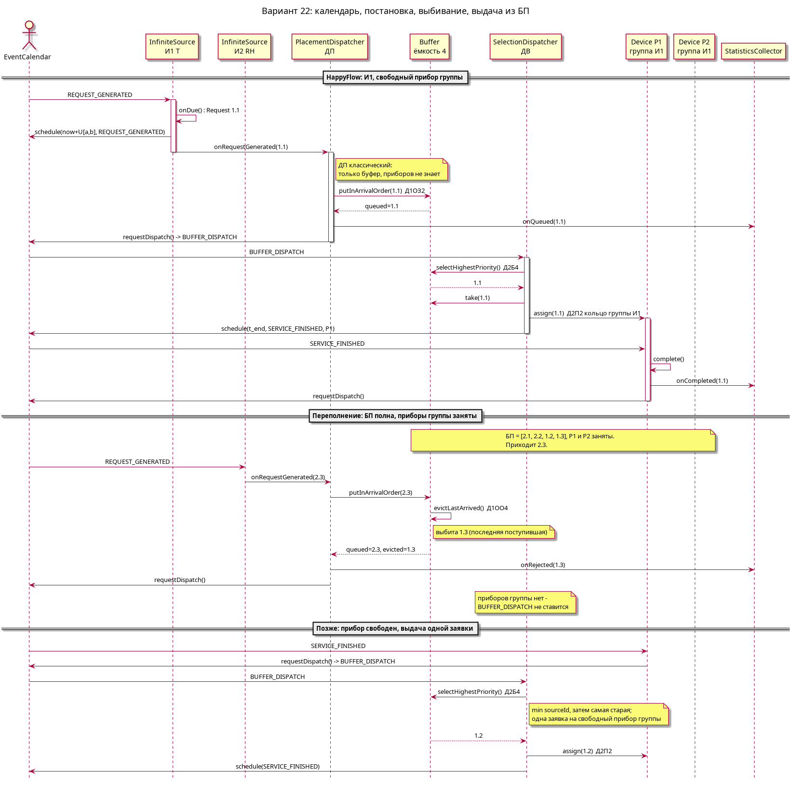
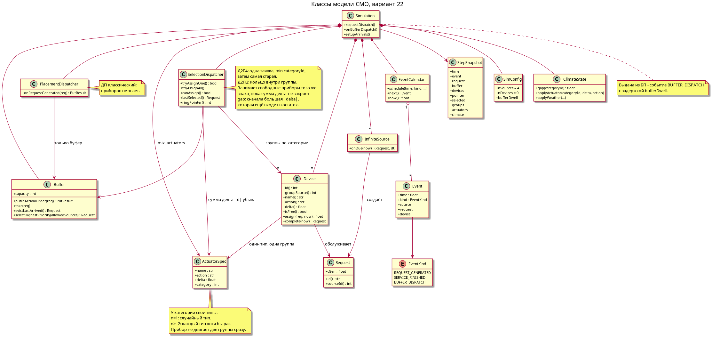
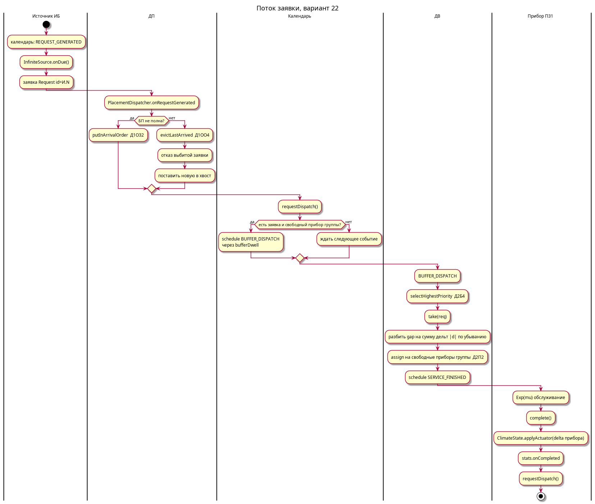
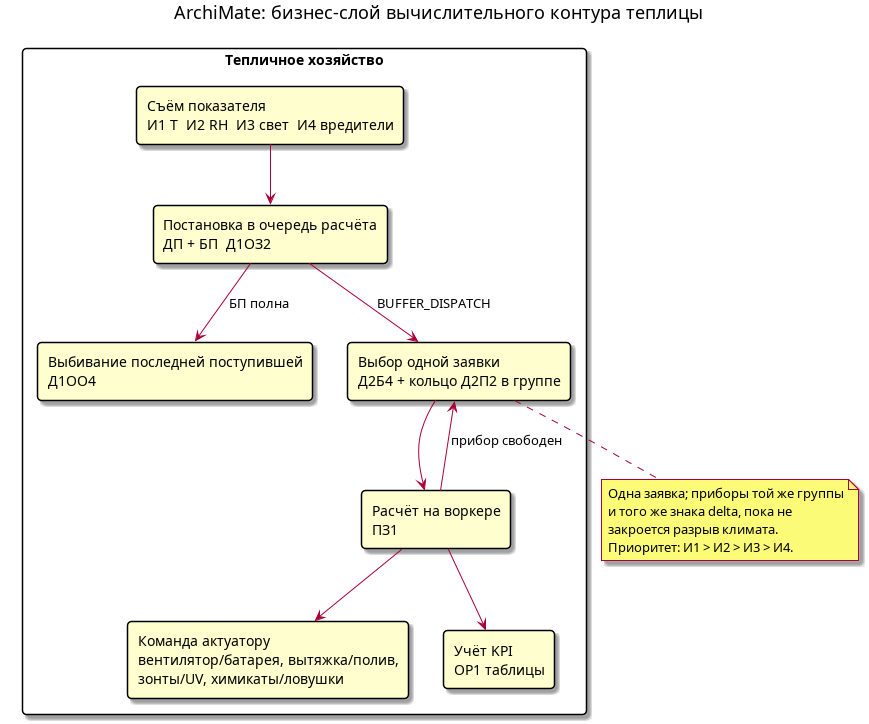

# Имитационная модель ВС (СМО), вариант 22

Микросервисная имитационная модель вычислительного контура теплицы.
Приборы СМО - **воркеры** (средства ВТ), не нагреватель и не лампа.
Qt показывает среду после обслуживания заявок.

```
ИБ  ИЗ2  ПЗ1  Д1ОЗ2  Д1ОО4  Д2П2  Д2Б4  ОР1  ОД1
```

| Код | Значение |
|---|---|
| **ИБ** | Бесконечные источники (датчики) |
| **ИЗ2** | Генерация ~ U[a, b] |
| **ПЗ1** | Обслуживание ~ Exp(mu) |
| **Д1ОЗ2** | В хвост очереди, при изъятии - сдвиг |
| **Д1ОО4** | Выбивание **последней поступившей** в БП (меньше всех простояла) |
| **Д2П2** | Прибор по кольцу (указатель внутри группы показателя) |
| **Д2Б4** | Приоритет источника, **по одной заявке**; среди равных - самая старая |
| **ОР1** | Авторежим: таблицы |
| **ОД1** | Пошагово: календарь событий, буфер, текущее состояние |

Приоритет: И1 > И2 > И3 > И4. На каждый датчик - **группа из двух приборов**
(P1-P2 температура, P3-P4 влажность, P5-P6 свет, P7-P8 вредители).
ДП **не знает** о приборах. Буфер **общий**. Выдача из БП идёт событием
`BUFFER_DISPATCH` с задержкой `--buffer-dwell`.

## Микросервисная архитектура

Каждый узел ниже - отдельный сервис со своим API. Связь только по
именованным событиям шины (`requests.generated`, `buffer.put`,
`buffer.updated`, `buffer.rejected`, `request.selected`, `device.assign`,
`device.freed`). Календарь особых событий задаёт **модельное** время:
сервисы не спят по wall-clock, иначе ломается дисциплина СМО.

```
sensor-*  ->  dispatcher-put  ->  buffer  ->  dispatcher-select  ->  worker-*
     ^              |                              ^                  |
     +---------- event-calendar <------------------+------------------+
                              |
                         stats + greenhouse-sim
```

| Сервис | Каталог / класс | Контракт |
|---|---|---|
| `sensor-temp/humidity/light/pests` | `services/source.py` | по событию календаря отдаёт `Request`, планирует следующее ~ ИЗ2 |
| `dispatcher-put` | `services/placement.py` | `onRequestGenerated(req)` -> только буфер |
| `buffer` | `domain/buffer.py` | `putInArrivalOrder`, `take`, `evictLastArrived` |
| `dispatcher-select` | `services/selection.py` | `BUFFER_DISPATCH`: Д2Б4 + кольцо Д2П2 в группе |
| `worker-1..m` | `services/device.py` | `assign(req)` / `complete()`, время ~ ПЗ1 |
| `event-calendar` | `services/calendar.py` | очередь особых событий |
| `stats` | `services/stats.py` | таблицы ОР1 |
| `greenhouse-sim` | `greenhouse-sim/` | UI теплицы; читает JSON-кадры `./smo.py step --json-lines` |

ДП не вызывает воркеры. Актуаторы климата - побочный эффект `complete()`, не приборы СМО.











Исходники PlantUML: [docs/diagrams/](docs/diagrams/). Пересборка: `plantuml docs/diagrams/*.puml`.

Отчётные тексты:

- [Бизнес-домен](docs/business-model.md)
- [Маппинг домена на элементы СМО](docs/mapping.md)
- [Первичные артефакты](docs/primary-artifacts.md)
- [Риски](docs/risks.md)

## Запуск

Точка входа - скрипт `smo.py` в корне репозитория (пакет модели остаётся `src/smo/`).

```bash
chmod +x smo.py
./smo.py decode
./smo.py decode --help
./smo.py step --help
./smo.py auto --help
./smo.py step -n 30
./smo.py auto                   # календарь -> auto.log
python3 ./smo.py step -n 30     # если нет права execute
```

Qt-окно `greenhouse-sim/greenhouse-sim` (`qmake && make`) запускает `../smo.py`.
Код окна: `main.cpp` (вход), `app_window.cpp` (раскладка и процесс), `greenhouse_view.cpp` (дом),
`pipeline_view.cpp` (схема), `sim_launch.cpp` (флаги).

### Окно теплицы

```bash
cd greenhouse-sim
qmake greenhouse-sim.pro
make
./greenhouse-sim --help
./greenhouse-sim --buffer 6 --opt-temp 26 --buffer-dwell 0.4
```

Симуляция сразу бесконечная (`./smo.py step --infinite --json-lines --pull`).
Флаги те же, что у `./smo.py step`: буфер, источники, приборы, оптимум, климат, `--buffer-dwell`.
Список: `./greenhouse-sim --help`.
Кнопки: пауза/продолжить, быстрее/медленнее,
случайная погода (климат на лету, очередь и приборы не сбрасываются), перезапуск.
Справа - анимация заявки по цепочке И -> ДП -> БП -> ДВ -> приборы.
Погода идёт по суточному ходу и по облакам (больше/крупнее облака - меньше свет).
После обслуживания заявка двигает климат к оптимальным ростовым условиям.
Что нарисовано на картинке: [docs/GUI-README.md](docs/GUI-README.md).
